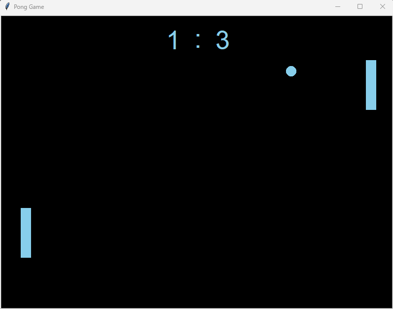

# PongGame

Simple game built with Python (imports: turtle, time)

## Installation

It is recommended to clone the complete repository or download the zip file.
You can do this by running the following command:
```
git clone https://github.com/dawidj126/PongGame.git
```


## Screenshots

<p align="center">
   
</p>
